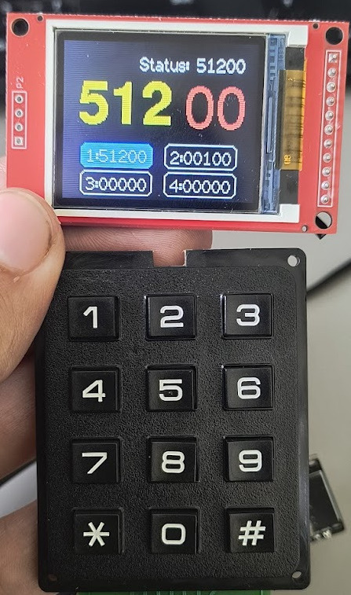

# Ovladač pro kostelní čísla
Na bázi ESP32 a WIFI. Pro projekt [church-numbers](https://github.com/mrazekv/church-numbers).

## Hardware
- [ESP32 (obchod LáskaKit)](https://www.laskakit.cz/iot-esp-32s-2-4ghz-dual-mode-wifi-bluetooth-rev-1--cp2102/)
- [TFT 1.8" ST7735 (1.8" 128x160 TFT displej, ST7735, SPI) – obchod LáskaKit](https://www.laskakit.cz/128x160-barevny-lcd-tft-displej-1-8--spi/)
- [Klávesnice 4x3 – obchod LáskaKit](https://www.laskakit.cz/arduino-4x3--maticova-tlacitkova-klavesnice-plastova/)

## Zapojení 
        
| Display | ESP      |
|---------|----------|
| VCC     | 3V3      |
| GND1    | NC       |
| GND2    | GND      |
| CLK     | GPIO 18  |
| SDA     | GPIO 23  |
| RS      | GPIO 2   |
| RST     | GPIO 4   |
| CS      | NC       |

| Klávesnice PIN | Klávesnice název | ESP      |
|:--------------:|:----------------:|:--------:|
| 1              | NC               | NC       |
| 2              | COL2             | GPIO 32  |
| 3              | ROW1             | GPIO 33  |
| 4              | COL1             | GPIO 25  |
| 5              | ROW4             | GPIO 26  |
| 6              | COL3             | GPIO 27  |
| 7              | ROW3             | GPIO 14  |
| 8              | ROW2             | GPIO 12  |

## Přeložení
Je potřeba použít platformio, viz [dokumentace](https://docs.platformio.org/en/latest/quickstart/index.html).
Po instalaci knihoven je potřeba nakopírovat soubor `src/User_Setup.h.example` do `.pio/libdeps/TFT_eSPI/User_Setup.h` a upravit podle potřeby (nemělo by být potřeba, pokud používáte ESP32 a TFT 2.4" ILI9341).

## Použití
Po nahrání programu do ESP32 se vytvoří přístupový bod (ESP32-XXXXXX) a připojíte se k němu. Poté otevřete webový prohlížeč a přejděte na adresu `http://192.168.4.1`. Nastavíte WiFi připojení a adresu serveru, na který se budou posílat data. Po uložení se ESP32 restartuje a připojí k zadané WiFi síti.
Po připojení se ESP32 přihlásí k serveru a začne přijímat data. Data se zobrazují na displeji a jsou odesílána na server.
Klávesnice slouží k ovládání displeje a zadávání čísel. 

### Ovládání
- krátký stisk čísla - psaní pětimístného čísla (neodesílá se)
- klávesa '#' - odeslání čísla na server
- klávesa '*' - přidání čísla sloky a rovnou odeslání na server (při hraní)
- dlouhý stisk 1-4 - přepínání mezi pamětmi 
- dlouhý stisk '*' - snížení čísla sloky

Displej se nevypíná, pokud je připojen k napájení. Při odpojení napájení se zapomene nastavení čísel.